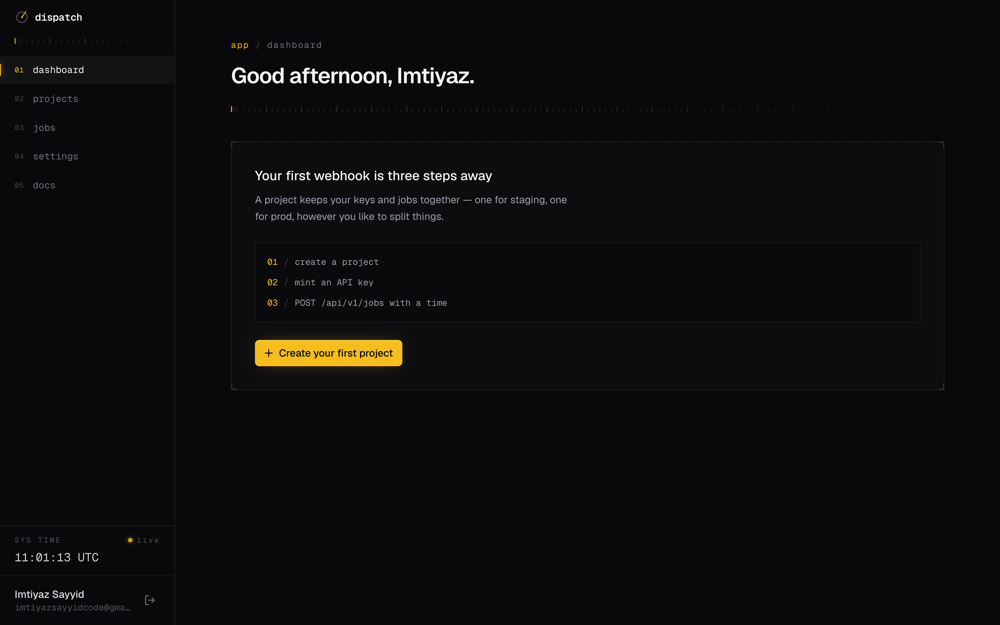

# Dispatch

**Open-source webhook scheduling for developers.** POST a job with a URL and a time — Dispatch fires the webhook at exactly that moment. No cron to babysit, no queue to operate, no in-memory timer that dies on restart.

**Live demo** → [dispatch.imtiyazsayyid.in](https://dispatch.imtiyazsayyid.in)



---

## How it works

1. Create a project and grab an API key from the dashboard.
2. `POST` a job to the Dispatch API with a `webhookUrl` and a `fireAt`.
3. Dispatch calls your webhook at the scheduled time — you handle the logic.

```bash
curl -X POST https://api-dispatch.imtiyazsayyid.in/api/v1/jobs \
  -H "x-api-key: sk_your_api_key" \
  -H "Content-Type: application/json" \
  -d '{
    "title": "Send invoice email",
    "webhookUrl": "https://myapp.com/webhooks/invoice",
    "fireAt": "2026-06-15T10:00:00Z",
    "payload": { "invoiceId": 123 }
  }'
```

---

## Features

- **Reliable scheduler** — every job is claimed atomically before it fires, so it's never sent twice; a self-healing sweep catches up anything that came due during downtime, so a restart never drops a job.
- **Auto-retry with backoff** — failed deliveries retry on a 30s → 1m → 5m schedule (and the backoff survives restarts), then mark the job dead after 3 attempts.
- **Bounded deliveries** — webhook calls have a 30s timeout, and crashed mid-fire jobs are recovered automatically.
- **Secure by default** — email-verified signups, correct password reset (single-use tokens, sessions invalidated), an SSRF guard that blocks webhooks aimed at internal/cloud-metadata addresses, rate limiting, and a CORS allowlist.
- **Full delivery logs** — every attempt, response code, and body, stored per job.
- **Multi-project** — separate projects, each with their own API keys.
- **No SDK required** — plain HTTP, works with any language or framework.
- **Self-hostable** — MIT-licensed, runs as two Node processes behind nginx.

---

## Architecture

A monorepo with two apps that deploy independently:

| Folder                                 | What it is                                                             | Port |
| -------------------------------------- | ---------------------------------------------------------------------- | ---- |
| [`dispatch-backend`](dispatch-backend) | Express + TypeScript API and the scheduler. Prisma over MySQL/MariaDB. | 4000 |
| [`dispatch-web`](dispatch-web)         | Next.js dashboard, docs, and landing page.                             | 3000 |

---

## Quick start (local development)

**Prerequisites:** Node.js 20+, a MySQL 8+ / MariaDB database, and a Gmail account with an [App Password](https://myaccount.google.com/apppasswords) (signup sends a verification email).

```bash
git clone https://github.com/imtiyazsayyidpro/dispatch
cd dispatch

# 1 · the API
cd dispatch-backend
cp .env.example .env          # set DATABASE_URL and the GMAIL_* vars
npm install                   # also runs `prisma generate`
npx prisma migrate dev        # create the schema
npm run dev                   # http://localhost:4000

# 2 · the dashboard (second terminal)
cd dispatch-web
echo "NEXT_PUBLIC_API_URL=http://localhost:4000" > .env.local
npm install
npm run dev                   # http://localhost:3000
```

> **Note:** `NEXT_PUBLIC_API_URL` is inlined at build time, so it must be set **before** `npm run build`. Changing it later requires a rebuild.

---

## Deployment

The supported topology is both processes under **PM2** with **nginx** in front. You can run them on one domain (path-routed) or on separate domains for the API and dashboard.

```bash
# on the server
git clone https://github.com/imtiyazsayyidpro/dispatch && cd dispatch

# API
cd dispatch-backend
cp .env.example .env          # fill in the variables below
npm install                   # runs prisma generate
npx prisma migrate deploy
npm run build
pm2 start dist/src/index.js --name api-dispatch

# dashboard
cd ../dispatch-web
cp .env.example .env.local     # set NEXT_PUBLIC_API_URL to the API's URL
npm install
npm run build
pm2 start "npm run start" --name dispatch-web
```

Example nginx for a **split-domain** setup (`dispatch.imtiyazsayyid.in` + `api-dispatch.imtiyazsayyid.in`):

```nginx
server {
    server_name api-dispatch.imtiyazsayyid.in;
    location / {
        proxy_pass http://127.0.0.1:4000;
        proxy_set_header Host $host;
        proxy_set_header X-Forwarded-For $proxy_add_x_forwarded_for;
        proxy_set_header X-Forwarded-Proto $scheme;
    }
}

server {
    server_name dispatch.imtiyazsayyid.in;
    location / {
        proxy_pass http://127.0.0.1:3000;
        proxy_set_header Host $host;
        proxy_set_header X-Forwarded-For $proxy_add_x_forwarded_for;
        proxy_set_header X-Forwarded-Proto $scheme;
    }
}
```

Then add TLS with `sudo certbot --nginx`. The **full self-hosting guide** (single-domain path routing, PM2 ecosystem file, upgrades, limitations) lives in-app at [`/docs/self-hosting`](dispatch-web/src/app/docs/self-hosting/page.tsx).

### Environment variables

**`dispatch-backend/.env`**

| Variable                            | Required     | Description                                                                              |
| ----------------------------------- | ------------ | ---------------------------------------------------------------------------------------- |
| `DATABASE_URL`                      | ✅           | MySQL/MariaDB connection string for Prisma.                                              |
| `GMAIL_USER` / `GMAIL_APP_PASSWORD` | ✅           | Gmail + App Password for verification & reset emails.                                    |
| `FRONTEND_URL`                      | ✅           | Public dashboard URL, used in password-reset links.                                      |
| `CORS_ORIGINS`                      | split-domain | Comma-separated browser origins allowed to call the API.                                 |
| `PORT`                              | —            | API port (default `4000`).                                                               |
| `TRUST_PROXY`                       | behind proxy | Set `true` behind nginx so rate limiting sees real client IPs.                           |
| `ALLOW_PRIVATE_WEBHOOKS`            | —            | Set `true` to allow webhooks to private/internal addresses (off by default; SSRF guard). |

**`dispatch-web/.env.local`**

| Variable              | Required | Description                                      |
| --------------------- | -------- | ------------------------------------------------ |
| `NEXT_PUBLIC_API_URL` | ✅       | Public origin of the API. Inlined at build time. |

---

## API reference

Developer-facing job endpoints authenticate via the `x-api-key` header. The dashboard endpoints use session auth.

### Schedule a job

```
POST /api/v1/jobs
x-api-key: sk_your_key
```

```json
{
  "title": "string",
  "webhookUrl": "https://your-app.com/webhook",
  "fireAt": "2026-06-15T10:00:00Z",
  "payload": {}
}
```

### Cancel a job

```
DELETE /api/v1/jobs/:id
x-api-key: sk_your_key
```

When a job fires, your endpoint receives a `POST` with `{ jobId, title, payload, firedAt }`.

---

## Stack

- **Backend** — Node.js, Express, TypeScript, Prisma, MySQL/MariaDB
- **Frontend** — Next.js, Tailwind CSS, shadcn/ui, Framer Motion
- **Scheduling** — DB-backed with atomic job claiming and a self-healing sweep (crash- and restart-safe)

---

## License

MIT © [Imtiyaz Sayyid](https://github.com/imtiyazsayyidpro)
